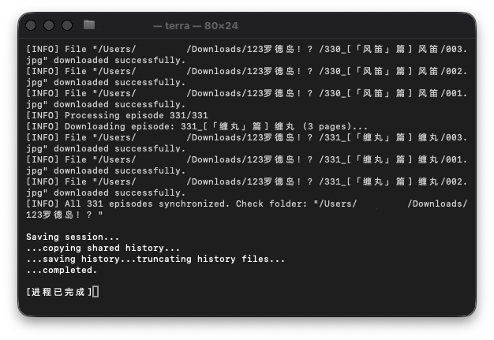

# Terra-Historicus-Comic-Downloader-cpp 📚

一款用于下载《明日方舟》官方漫画（123罗德岛！？）的命令行工具，支持 Windows 和 macOS。

---

## 📦 下载与安装

### 🪟 Windows (64 位)
- 下载 **[terra-win64.zip](https://github.com/Ryan83602/Terra-Historicus-Comic-Downloader-cpp/releases/latest/download/terra-win64.zip)**
- 解压后双击 `terra.exe` 即可运行
- 若需指定漫画 ID，可在命令行中执行：`terra.exe 6253`

### 🍎 macOS (通用二进制，支持 Intel 和 Apple Silicon)
- **macOS**：下载 **[terra-mac.zip](https://github.com/Ryan83602/Terra-Historicus-Comic-Downloader-cpp/releases/latest/download/terra-mac.zip)**，解压后双击 `terra` 运行。若提示“无法打开”，请右键点击文件选择“打开”并确认。
- 首次运行可能需要允许未签名应用（系统偏好设置 → 安全性与隐私 → 仍要打开）

---

## 🚀 使用方法

1. **默认下载**：直接运行程序，默认下载漫画 ID `6253`（123罗德岛！？）。
2. **指定漫画 ID**：
   ```bash
   terra 1234 # 替换为你想下载的漫画 ID

3. **文件保存位置**：所有图片将保存在**程序运行目录**下的 `漫画名/` 文件夹中，按章节分目录，图片按页码命名。



---

## ✨ 特性

- ✅ 支持断点续传（已下载的章节自动跳过）
- ✅ 多线程并发下载（高效快速）
- ✅ 完整支持中文文件夹和文件名
- ✅ 跨平台（Windows / macOS）
- ✅ 轻量级，无额外依赖（Windows 版已包含所需 DLL）

---

## ⚠️ 注意事项

- Windows 用户请保留 `terra.exe` 同目录下的所有 `.dll` 文件。
- macOS 用户若遇到“无法验证开发者”，请右键点击文件，选择“打开”并确认。
- 下载目录不能包含特殊字符（如 `#`、`%`），建议放在纯英文路径下运行。
- 如遇网络错误，程序会自动重试 5 次，请保持网络畅通。

---

## 📜 许可证

本C++实现是全新独立开发，与旧版Python仓库（GPL-3.0）无代码关联。本项目仅适用AGPL-3.0。

本项目采用 [GNU Affero General Public License v3.0](LICENSE) 开源协议。

---

## 🔗 链接

- [GitHub 仓库](https://github.com/Ryan83602/Terra-Historicus-Comic-Downloader-cpp)
- [问题反馈](https://github.com/Ryan83602/Terra-Historicus-Comic-Downloader-cpp/issues)

---

### 版权声明

本项目（Terra-Historicus-Comic-Downloader-cpp）仅为个人学习与研究用途的命令行工具。

*   **内容归属**：本项目所涉及的所有漫画内容，包括但不限于“罗德岛”、“123罗德岛!?”等，其全部知识产权均归 **鹰角网络（Hypergryph）** 所有。
*   **工具性质**：本工具仅提供一种技术实现方式，用于访问鹰角网络官方漫画平台已公开的内容。开发者不对任何下载内容的使用负责。
*   **侵权处理**：若本项目侵犯了您的合法权益，请通过 GitHub Issues 联系我们，我们将第一时间进行处理。若您认为有必要，请直接通过 GitHub 官方渠道发起 DMCA Takedown Notice。我们将严格遵守平台规则，配合处理相关事宜。

---

**Enjoy!** 🎉
